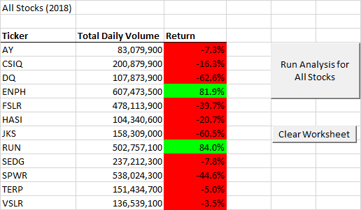

# Stock Analysis

## Overview of Project

As a Data Analyst, we were tasked by our new client Steve to run an anlaysis onstocks for his parents, specifically the DQ Stock.  After the initial analysis and seeing the perfomance of DQ, Steve decided to get ananalysis on all stocks to give his parents more investment opportunities.  After completing the All Stock Analyisis, it was decided to refactor the code to give a quicker, more efficient analyasis.  
  
## Results:

### 2017 Stock Analysis
  As indicated in the All Stocks (2017) Image below it is obvious that all of the stocks but one (TERP) faired very well.  The chosen stock of Steve's parents had the highest return at 199.4%.

**Note:  The code for the All Stock Analysis prior to refraction ran in 0.8828125 seconds, after refraction the code ran in 0.0625 seconds.  Again, much faster than the previous analysis. 

### 2018 Stock Analysis

  2018 didn't fair as well.  In the image below we see that all the stocks but one (RUN) had a significant decrease in their Returns.  The RUN stock did have a considerable gain.  While it is still in the negative the TERP Stock did move up a little, trying to pull itself out of the red.

**Note: The code for the All Stock Analysis prior to refraction ran in 0.859375 seconds, after refraction the code ran in 0.046875 seconds.  Much faster than the previous analysis.

### Code Changes

Changes during refactoring, shown below, that the script loops through the stock data to give us the values for each row: 

 ''2b) Loop over all the rows in the spreadsheet.
    For i = 2 To RowCount
                  
        '3a) Increase volume for current ticker
        tickerVolumes(tickerIndex) = tickerVolumes(tickerIndex) + Cells(i, 8).Value
                        
        '3b) Check if the current row is the first row with the selected tickerIndex.
        'If  Then
        If Cells(i - 1, 1).Value <> tickers(tickerIndex) Then
            tickerStartingPrices(tickerIndex) = Cells(i, 6).Value
            
        End If
        
        '3c) check if the current row is the last row with the selected ticker
        'If  Then
        If Cells(i, 1).Value = tickers(tickerIndex) And Cells(i + 1, 1).Value <> tickers(tickerIndex) Then
            tickerEndingPrices(tickerIndex) = Cells(i, 6).Value
        
        
        '3d Increase the tickerIndex.
        tickerIndex = tickerIndex + 1
          
       End If
    
    Next i

## Summary:

Running the two separate Stock Analysis we can tell that after refactoring the Analysis ran quicker.  Cleaning up the code proved to make the analysis more efficient and showing a plan will allow future analysts the information need to make changes and add additional years if needed.

### What are the advantages or disadvantages of refactoring code?

  A couple of advantages to refactoring our code is to 1) clean up the code.  There may be redundancies that can be removed, assisting others in seeing what/why a certain code was written, 2) speeds up the analysis by improving the logic of the code, and 3) it makes it more efficient.
  
  A couple of disadvantages to refactoring is that 1) it is very time consuming, 2) it could affect the outcomes, and 3) it could, potentially, leave you with a bigger issue if you don't have a plan 

### How do these pros and cons apply to refactoring the original VBA script?

  The original VBA Script ran slower then the refactored.  Cleaning up the code and laying out a plan will assist future analysts understand the ins and outs for possible updates and changes.
